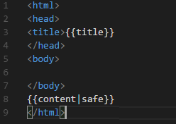

# Examples

In this page, you can see some examples of use for Blask. From creating our first post, to creating templates.

## Configure and run Blask

First if you need to run Blask, need to see the `settings.py` file and set the properly configuration.

    :::python
    import os

    BASE_DIR = os.getcwd()

    # Templates directory
    templateDir = os.path.join(BASE_DIR, 'templates')

    # Posts directory
    postDir = os.path.join(BASE_DIR, 'posts')

    # Default layout template
    defaultLayout = "template.html"

    # Static files directory
    staticDir = os.path.join(BASE_DIR, 'static')

    # Website title
    title = 'Blask | A Simple Blog Engine Based on Flask'
    # custom Error handlers
    errors = { 404 : "404"}

Next you need to run the next code:

    :::python
    from Blask import BlaskApp
    
    BlaskApp().run()

To get the properly Configuration, you need to export the environment variable BLASK_SETTINGS to select the properly _settings_ module:

    :::bash
    > export BLASK_SETTINGS=settings

You can also, run Blask from the Command Line Tool:

    :::bash
    > blaskcli run

Then browse to `http://localhost:5000` and see the *Blask Home Page*. Of course you can modify the markdown, and see how it changes.

## Create a first post

To create a new post, all you need to do is create a new markdown file in the posts directory. For Example:

File: `newpost.md`

<pre>
---
date: 2018-04-04
template: template.html
tags: blask,test
---
This is an example of **MarkDown**. This is a test _web page_.
</pre>

Once we save the previous file, we can point the browser to http://localhost:5000/newpost and see the results.

## Create a template

To create a new template, create a new HTML file in the templates folder, and inside the HTML code
include the Jinja2 template `content`. Here is an example:

Once you create a new template, you can reference it in two ways:

* First, using the default template setting in the `settings.py` file.
* Second, using the metadata space of the Markdown documents.
